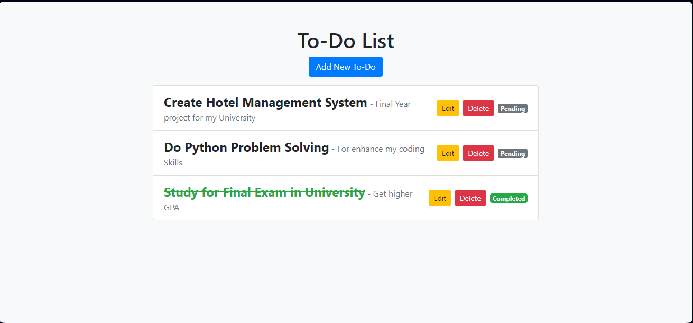

# To-Do-App----Django
 
This is a simple Todo app built using Django. It allows users to create, read, update, and delete tasks.

### Screenshots



## Features

- Add new tasks
- View all tasks
- Edit tasks
- Delete tasks
- Mark tasks as completed

## Getting Started

Follow these instructions to get a copy of the project up and running on your local machine for development and testing purposes.

### Prerequisites

- Python 3.6+
- Django 3.0+

### Installation

1. **Clone the repository:**

    ```bash
    https://github.com/kavindu-vk/To-Do-App----Django.git
    cd To-Do-App----Django
    ```

2. **Create and activate a virtual environment:**

    ```bash
    python -m venv env
    source env/bin/activate  # On Windows use `env\Scripts\activate`
    ```

3. **Install the required packages:**

    ```bash
    pip install -r requirements.txt
    ```

4. **Run database migrations:**

    ```bash
    python manage.py makemigrations
    python manage.py migrate
    ```

5. **Run the development server:**

    ```bash
    python manage.py runserver
    ```

6. **Open your browser and navigate to:**

    ```
    http://localhost:8000/
    ```
